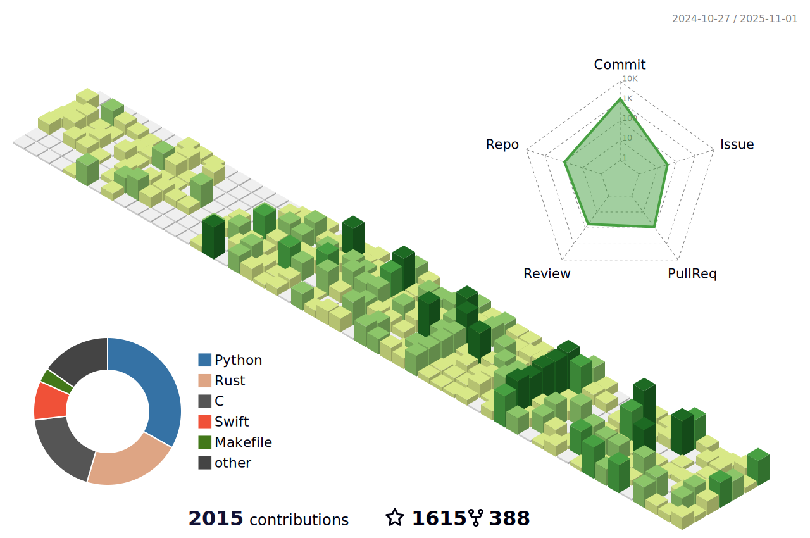

### Hi~ this is wheatfox🦊

Currently a PhD student@PKU, researching LLVM, Operating Systems, Heterogeneous Hardwares and Rust.

fun facts about wheatfox:

1. I write game music and electronic music. [soundcloud](https://soundcloud.com/wheatfox), [spotify](https://open.spotify.com/artist/1u5SE8RW4ivt3LgZR7skkO), [bandcamp](https://wheatfox.bandcamp.com/)
2. like foxes and nature

wheatfox's OS blog website
[www.oscommunity.cn](https://www.oscommunity.cn)

- Peking University(now)
- contact at enkerewpo@hotmail.com / yulonghan@stu.pku.edu.cn
- homepage at [wheatfox's den](https://wheatfox.dev)

#### Stats

